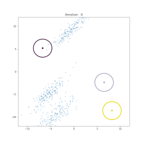
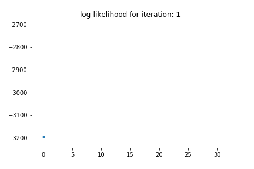

# GMM-EM-Python
 Python implementation of Expectation-Maximization algorithm (EM) for Gaussian Mixture Model (GMM).

 Code for GMM is in [GMM.py](GMM.py). It's very well documented on how to use it on your data. For an example and visualization for 2D set of points, see the notebook [EM_for_2D_GMM.ipynb](EM_for_2D_GMM.ipynb).

  

## Requirements:
 - Numpy
 - Scipy
 - Matplotlib
 
## Documentation:
 **_class_ `GMM`:**
 - **Parameters:**
 	- `k`: Number of clusters
 	- `dim`: Dimension
 	- `mu`: Means of all clusters
 	- `sigma`: Covariance matrix of all clusters
 	- `pi`: Proportions of each cluster in P(x)
 	- `colors`: Colors for each cluster for plotting
 	- `z`: Latent variable Z (defined during EM init)
 	- `num_points`: Number of data points (defined during EM init)
 	- `data`: Dataset (defined during EM init)
 - **Functions:**
 	- `__init__(self, k, dim, init_mu=None, init_sigma=None, init_pi=None, colors=None)`

		 Defines a model with known number of clusters and dimensions.
 		 
 		 input:
		 - `k`: Number of Gaussian clusters
	     - `dim`: Dimension 
	     - `init_mu`: initial value of mean of clusters `(k, dim)`
               (default) random from uniform[-10, 10]
	     - `init_sigma`: initial value of covariance matrix of clusters `(k, dim, dim)`
                  (default) Identity matrix for each cluster
	     - `init_pi`: initial value of cluster weights `(k,)`
               (default) equal value to all cluster i.e. 1/k
	     - `colors`: Color valu for plotting each cluster `(k, 3)`
              (default) random from uniform[0, 1]

    - `init_em(self, X)`

 		 Initialization for EM algorithm.
 
 		 input:
	     - `X`: data `(batch_size, dim)`
    
    - `e_step(self)`
 
 		 E-step of EM algorithm.

    - `m_step(self)`

 		 M-step of EM algorithm.

    - `log_likelihood(self, X)`
 
  		 Compute the log-likelihood of X under current parameters

  		 input:
	     - `X`: Data (batch_size, dim)
 
  		 output:
	     - `log-likelihood of X`: Sum_n Sum_k log(pi_k * N( X_n | mu_k, sigma_k ))

    - `plot_gaussian(self, mean, cov, ax, n_std=3.0, facecolor='none', **kwargs)`
    
    	 Utility function to plot one Gaussian from mean and covariance.

    - `draw(self, ax, n_std=2.0, facecolor='none', **kwargs)`
	  
	  	 Function to draw the Gaussians (only for two-dimensionl dataset).

## TODO:
- Handling singular covariance matrix problem.
- Better initialization methods.